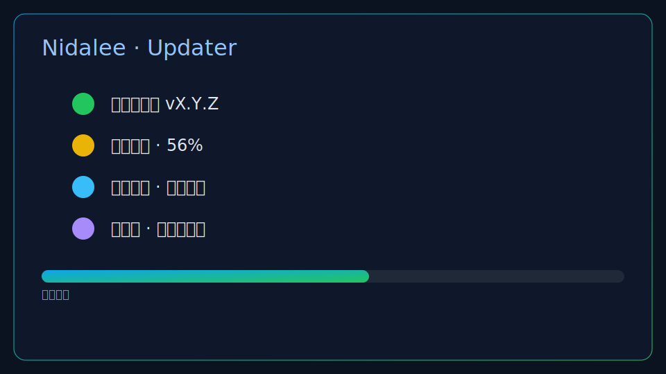
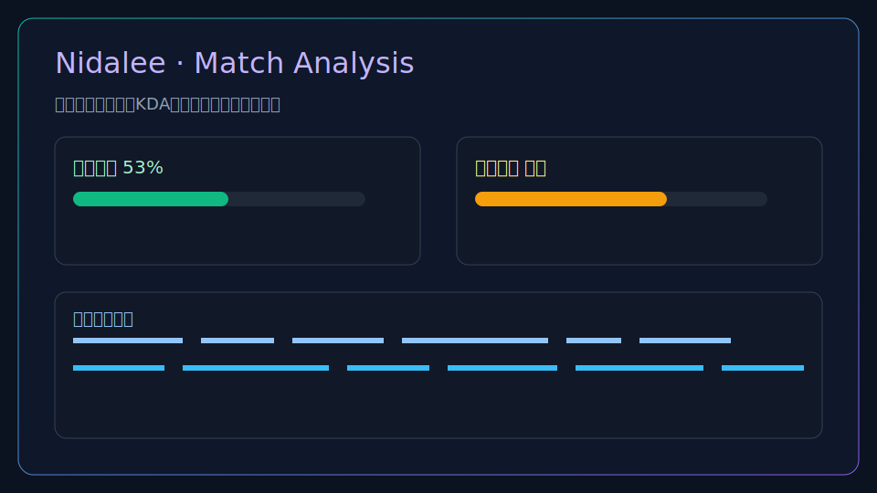

# 🎲 Mayhem Helper（海克斯大乱斗助手）

> **本项目是 [Nidalee](https://github.com/codeXcn/Nidalee)（CC BY-NC-SA 4.0）的衍生作品**，专为**国服海克斯大乱斗（ARAM: Mayhem）**增加：游戏内浮层看海克斯优先级、客户端一键导入出装、离线速查库。遵循 CC BY-NC-SA 4.0（署名 + 非商用 + 同样式共享）。

### 📥 下载 & 使用
- **[下载安装包（Windows）](https://github.com/MonsterZUO/mayhem-helper/releases/latest)** — exe / msi 双击安装
- **[📖 用户手册](./docs/user-manual.md)** — 怎么装、怎么用、常见问题（先看这个）

**给 agent / 开发者**：动手前先读 [`CONTEXT.md`](./CONTEXT.md)（术语）、[`docs/target-effect.md`](./docs/target-effect.md)（目标效果）、[`docs/adr/`](./docs/adr)（关键决策）、[`docs/self-acceptance.md`](./docs/self-acceptance.md)（验收状态与 Windows 待验项）。

**关键须知**：
- 🖥️ **运行在 Windows**（LoL 国服）。开发机可 macOS，但 LCU/浮层/出装写入等活体功能须 Windows 验。
- 🌐 **数据源 Blitz Datalake 是外服(KR)**——国服无代理能否连通**须真机实测**（见 ADR-0001）。连不上时自动回退**打包的 173 英雄出厂快照**。
- 🎯 浮层游戏须设**无边框**模式方可覆盖显示。
- 🚫 只走官方 LCU + OS 置顶窗，**不注入 / 不读屏 / 不替你选三选一**。

数据来源：Blitz Datalake（战绩）、CommunityDragon（海克斯元数据）。

---

# 🎮 Nidalee（上游基座）


High-performance, lightweight assistant for League of Legends.

Nidalee integrates auto-accept, auto pick/ban, real-time data insights, and customizable settings to help you climb efficiently and safely. Powered by Rust + Tauri for fast startup and low resource usage.

[](https://creativecommons.org/licenses/by-nc-sa/4.0/legalcode)


[](https://github.com/codeXcn/Nidalee/releases/latest)
[](https://github.com/codeXcn/Nidalee/releases)

English | [简体中文](./README_ZH.md)

---

## ⏱️ Quick Start

1. Download the latest installer from the [Releases page](https://github.com/codeXcn/Nidalee/releases/latest)
2. Install and launch the app; start your League client and log in
3. The app auto-connects to the client; see the sidebar for updater status

If automatic update fails at any time, click “Go to manual download” in-app or open the [Releases page](https://github.com/codeXcn/Nidalee/releases/latest).

## ✨ Features

- 🤖 Automation: auto-accept, auto pick/ban
- 📈 Insights: real-time analysis and statistics
- 🎯 Personalization: flexible presets, profile backgrounds, etc.
- 🔒 Safety: interacts only with official League Client API (LCU)

## ⚡ Quick Preview



Updater UX: check → download → install, with a manual fallback link.



Match analysis: team stats, lane matchups, and insights.

## 💡 Why Nidalee

- Built around LoL’s core flows: accept, pick/ban, match insights; lightweight and easy to use.
- Rust + Tauri deliver fast startup and low footprint for long-running sessions.
- Modern UI via shadcn-vue + Tailwind v4; consistent dark/light themes.
- Clear distribution & signature policy; only official releases are trusted.

### What this is (and isn’t)

- This is: a desktop assistant based on the official LCU; automation limited to client-exposed interfaces; focused on pick/ban and data insights.
- This isn’t: memory/process injection, packet tampering, scripts, or any cheat.

## System Overview

- Lightweight & performant: fast startup, low resource usage.
- Auto update: silent check on launch; one-click update in sidebar; fallback to manual download on failure.
- Trusted distribution: official Releases only, with detached signatures (.sig) to verify integrity.
- Modern UI & themes: OKLCH palette, clean and readable design.
- Stable & extensible: modular, composition-friendly codebase.
- Maintainers: see signing & security notes in `docs/tauri-signing.md`.

## 📦 Installation

- Latest release: <https://github.com/codeXcn/Nidalee/releases/latest>
- In "Assets", download the installer for your platform:
  - Windows: `.msi`
  - macOS: `.dmg`

> Tip: If an in-app update fails, open the [Releases page](https://github.com/codeXcn/Nidalee/releases/latest) and install manually.

System Requirements:

- Windows 10/11 (x64)
- macOS 12+ (Intel / Apple Silicon)
- Tip: Running as Administrator (Windows) can make installation/updates smoother

Platform matrix:

| Platform | CPU Architectures        | Package |
|----------|---------------------------|---------|
| Windows  | x64                       | .msi    |
| macOS    | Intel, Apple Silicon (M*) | .dmg    |

### Installation (Windows)

1. Download the `.msi`
2. Double‑click to install
3. Launch the app; it silently checks for updates on startup (progress shown in the sidebar)

### Installation (macOS)

1. Download the `.dmg` and open it
2. Drag the app into the Applications folder
3. On first launch, if blocked by Gatekeeper, right‑click the app in Applications → Open (or allow from System Settings → Privacy & Security)

## 🚀 Development

### Requirements

- Node.js 20+
- pnpm 10+
- Rust 1.70+
- Tauri CLI 2.0+

### Local Development

```bash
git clone https://github.com/codeXcn/Nidalee.git
cd Nidalee

# Install deps
pnpm install

# Dev (Tauri)
pnpm tauri dev

# Build (Tauri)
pnpm tauri build
```

### Project Structure

```text
Nidalee/
├── src/                    # Vue frontend
├── src-tauri/              # Tauri Rust backend
├── .github/workflows/      # GitHub Actions CI/CD
├── dist/                   # Build output
└── docs/                   # Documentation
```

## 📋 Feature Checklist

- [x] Base scaffolding
- [x] League Client API integration
- [x] CI/CD automated releases
- [x] User info and profiling
- [x] Auto accept match
- [x] Auto pick/ban
- [x] Game data analysis
- [x] Settings UI
- [ ] i18n

## 📖 Documentation

For comprehensive documentation, see the [docs/](docs/) folder or visit the [Documentation Center](docs/README.md).

### Quick Links

- User Guides
  - [Troubleshooting Guide](docs/troubleshooting.md)
  - [User Guide (English)](docs/user-guide.md)
  - [用户指南（中文）](docs/user-guide-zh.md)
- Developer Docs
  - [Contributing Guide](docs/contributing.md)
  - [Release Guide](docs/release.md)
  - [Changelog](docs/changelog.md)
- Maintainers
  - [Tauri Signing & Security](docs/tauri-signing.md)

## 🤝 Contributing

We welcome contributions! Please read our [Contributing Guide](docs/contributing.md) for detailed information on:

- Development workflow
- Code standards
- Commit conventions (Conventional Commits)
- Branch naming rules
- Pull request process

### Quick Start for Contributors

1. Fork and clone: `git clone https://github.com/<yourname>/Nidalee.git`
2. Create a feature branch: `git checkout -b feature/your-feature`
3. Install & run: `pnpm install && pnpm tauri dev`
4. Make changes and test
5. Run checks: `pnpm lint && pnpm type-check`
6. Submit a PR with clear description

For release process, see the [Release Guide](docs/release.md).

## 🌐 Network & Download

- Downloads use GitHub Releases and may be slow in some regions.
- If a download fails, the app shows “Go to manual download” to open the official Releases page.
- Additional mirrors may be provided later and will be announced here and in‑app.

## 🛠️ Troubleshooting

- Update fails / stuck: use “Go to manual download” and install from Releases.
- Windows SmartScreen: click “More info” → “Run anyway”, or unblock in file Properties.
- macOS Gatekeeper: allow the app in System Settings → Privacy & Security, or right‑click → Open in Finder to bypass the first‑run block.
- Cannot connect to LCU: ensure the League client is running; restart if needed; try running as Administrator; check logs.
- Permissions / write errors: run as Administrator; if still failing, re‑install from Releases; ensure the install path is writable.

## 📄 License

Licensed under [CC BY‑NC‑SA 4.0](https://creativecommons.org/licenses/by-nc-sa/4.0/legalcode).

See the LICENSE file for full terms.

## ⚠️ Disclaimer

This project is an auxiliary tool for League of Legends. All features rely on Riot Games’ official League Client API (LCU API) and local client data.

This tool does not modify, inject, or tamper with game memory, processes, or network data, nor provide any cheating/automation beyond LCU‑based interactions.

- Use must comply with the game’s user agreement and relevant policies.
- No personal sensitive data is collected or uploaded by this project.
- This project is not affiliated with Riot Games or Tencent and is not officially endorsed.
- You are solely responsible for any consequences arising from usage.

---

Built with ❤️ using [Tauri 2.0](https://tauri.app/) + [Vue.js](https://vuejs.org/)
